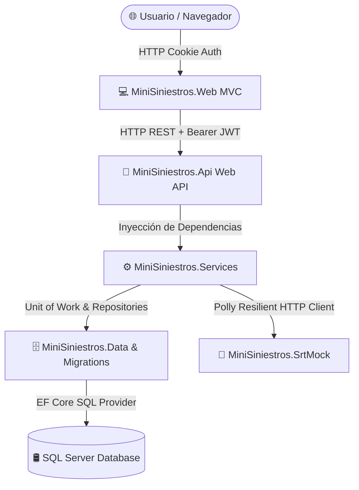

# 🚑 MiniSiniestros - Sistema de Gestión e Integración de Siniestros Laborales (ART / SRT)

Bienvenido al repositorio oficial de **MiniSiniestros**. Este proyecto es una solución empresarial distribuida basada en **.NET 8** diseñada para la gestión, seguimiento, auditoría y notificación ante la **Superintendencia de Riesgos del Trabajo (SRT)** de siniestros laborales de aseguradoras de riesgos del trabajo.

---

## 📐 1. Contexto de la Solución y Arquitectura

La solución está construida siguiendo los principios de  arquitectura en capas y patrones de diseño empresariales como **Repository Pattern**, **Unit of Work**, **Service Result Pattern** y **Polly Resilience Pipeline**.



### 📦 Estructura de Proyectos de la Solución (`MiniSiniestros.sln`)

| Proyecto | Tipo | Descripción y Responsabilidad |
| :--- | :--- | :--- |
| **`MiniSiniestros.Api`** | Web API (.NET 8) | Endpoints RESTful protegidos por **JWT Bearer**, manejo global de excepciones (`IExceptionHandler`), validaciones y documentación **Swagger OpenAPI**. |
| **`MiniSiniestros.Web`** | ASP.NET Core MVC | Aplicación Web UI receptiva (Bootstrap 5) con autenticación basada en **Cookies**, propagación automática de tokens JWT hacia la API mediante `HttpClient` tipado. |
| **`MiniSiniestros.Services`** | Biblioteca de Clases | Capa de lógica de negocio (`SiniestroService`, `AuthService`, `StrNotificationService`, etc.), integración Polly y mapeos con AutoMapper. |
| **`MiniSiniestros.Data`** | Biblioteca de Clases | Implementación de repositorios genéricos y específicos (`SiniestroRepository`, `UsuarioRepository`) y patrón `UnitOfWork`. |
| **`MiniSiniestros.Data.Migrations`**| Biblioteca de Clases | Migraciones de **Entity Framework Core** y semillas de datos iniciales (`DbInitializer`). |
| **`MiniSiniestros.Models`** | Biblioteca de Clases | Entidades del dominio (`Siniestro`, `Empleador`, `Trabajador`, `Prestador`, `Usuario`, `Rol`, etc.). |
| **`MiniSiniestros.Dto`** | Biblioteca de Clases | Objetos de Transferencia de Datos (DTOs) para peticiones y respuestas REST y Auth. |
| **`MiniSiniestros.ViewModels`** | Biblioteca de Clases | Modelos de vista para formularios, filtrado y paginación en el portal Web MVC. |
| **`MiniSiniestros.Common`** | Biblioteca de Clases | Constantes de error, enums de dominio, respuestas genéricas (`ServiceResponse<T>`) y estructuras de paginación (`PagedResponse<T>`). |
| **`MiniSiniestros.SrtMock`** | Web API (.NET 8) | Servicio simulado (Mock HTTP) para probar el envío síncrono/asíncrono de notificaciones a la SRT. |
| **`MiniSiniestros.Tests`** | Proyecto de Pruebas | Pruebas unitarias automatizadas con **xUnit**, **Moq**, **EF Core In-Memory** y **FluentAssertions** (87 tests pasando al 100%). |

---

## 🧠 2. Decisiones de Arquitectura, Trade-offs y Racional Técnico

Esta sección documenta las decisiones de diseño, compromisos (*trade-offs*) y justificaciones técnicas tomadas durante el desarrollo de la prueba técnica.

> [!NOTE]
> **Estructura del Proyecto y Separación de Responsabilidades**
> Además de la estructura solicitada, se introdujo un proyecto `Common` para centralizar enumeradores y clases transversales. En la capa de servicios, se optó por una estricta separación por dominios. Aunque el requerimiento base permitía recuperar los datos directamente mediante Inversión de Control (IoW), se tomó la decisión arquitectónica de separar las responsabilidades para garantizar la escalabilidad y mantenibilidad futura del sistema.

> [!NOTE]
> **Estrategia de Autenticación y Autorización (Feature Opcional Implementado)**
> Aunque este punto era un requerimiento opcional dentro del challenge, se decidió implementarlo para entregar una solución robusta y segura. Se desarrolló un sistema basado en tokens JWT (JSON Web Tokens), validación de roles y políticas de acceso. El sistema se entrega con 3 perfiles de usuario pre-configurados para facilitar a los evaluadores la prueba de los distintos niveles de privilegio, tanto en la WebAPI como en el cliente Web.

> [!NOTE]
> **Resiliencia e Integración con Terceros - SRT (Feature Opcional Implementado)**
> Asumiendo el desafío opcional propuesto, se diseñó una integración tolerante a fallos. Para evaluar el comportamiento del sistema, se desarrolló un *mock* del servicio externo (SRT) que simula un porcentaje aleatorio de caídas. Para mitigar esta inestabilidad, se implementaron patrones de resiliencia que garantizan que el sistema no colapse ante cortes de red. Adicionalmente, se incluyó el logueo en base de datos del *payload* correspondiente para asegurar una correcta auditoría y trazabilidad.

> [!NOTE]
> **Estrategia de Pruebas Unitarias y Cobertura**
> Si bien se desarrollaron pruebas unitarias para otros proyectos dentro de la solución, el **reporte final de cobertura** fue configurado para evaluar de manera exclusiva el *Core* del Negocio (Capa de Servicios) y los contratos de entrada/salida (API). Esta decisión técnica busca aislar la infraestructura para medir con precisión la calidad de la lógica central. Bajo este alcance específico, el reporte arroja un **74% de Line Coverage** y un sólido **62% de Branch Coverage**, garantizando la estabilidad de las reglas de negocio críticas y el correcto manejo de excepciones lógicas.

> [!NOTE]
> **Uso de IA como Herramienta de Productividad**
> Se utilizó Inteligencia Artificial como asistente técnico para acelerar tareas de configuración y *boilerplate*, manteniendo el foco analítico en la arquitectura backend:
> *   Generación base de los primeros tests unitarios en la capa de negocio y asistencia en la redacción de esta documentación (mediante agentes configurados previamente a la prueba).
> *   Generación de los archivos `.yml` para el CI/CD (GitHub Actions) y actualización iterativa del `docker-compose.yml` para el despliegue.
> *   Creación rápida de las vistas web basadas en los *ViewModels* preexistentes, asumiendo que el objetivo central de la prueba técnica reside en la arquitectura, la lógica de negocio y las integraciones, no en el diseño Front-End.

> [!NOTE]
> **Estrategia de Versionado (GitFlow y PRs)**
> Se adoptó un enfoque de desarrollo incremental. A medida que la solución creció, el trabajo se organizó mediante *Feature Branches* separadas por módulos (API, Web, SRT, JWT, Documentación, etc.). La integración se realizó mediante *Pull Requests* (PRs) agrupados lógicamente, asegurando que cada funcionalidad integrada estuviera respaldada por sus respectivos tests unitarios en la capa de negocio.

---

## 🛠️ 3. Tecnologías y Herramientas Utilizadas

- **Framework**: .NET 8 (`net8.0`)
- **Acceso a Datos / ORM**: Entity Framework Core 8 (`Microsoft.EntityFrameworkCore.SqlServer`, `Microsoft.EntityFrameworkCore.InMemory`)
- **Base de Datos**: Microsoft SQL Server (vía Docker Container o instancia local)
- **Seguridad & Autenticación**:
  - JWT (JSON Web Tokens) con firma HMAC-SHA256 para la API REST.
  - Cookie Authentication en MVC con propagación automática de la cabecera `Authorization: Bearer` en el cliente HTTP de la Web.
  - Autorización basada en Políticas de Roles (`Administrador`, `Operador`, `Analista`).
- **Resiliencia & Tolerancia a Fallos**: **Polly v8** (Retry exponencial con Jitter, Circuit Breaker y Timeout).
- **Mapeo de Objetos**: AutoMapper 13.0
- **Documentación API**: Swagger / OpenAPI 3.0 con comentarios XML nativos.
- **Logging**: Serilog estructurado (salida a Consola y Archivos diarios con contexto `SourceContext`).
- **Contenerización**: Docker & Docker Compose (`docker-compose.yml`)
- **Testing & Cobertura**: xUnit, Moq, Coverlet, ReportGenerator.

---

## 🔑 4. Usuarios de Semilla y Credenciales de Login

Al iniciar la aplicación por primera vez, el componente `DbInitializer` ejecuta las migraciones automáticas y puebla la base de datos con los siguientes usuarios de demostración:

| Usuario (`nombre`) | Contraseña (`password`) | Rol | Permisos y Políticas en la API |
| :--- | :--- | :--- | :--- |
| **`Admin`** | `Admin*2026` | **`Administrador`** | 🟢 Acceso Total (`RequireAdminRole`, `RequireOperadorRole`, `RequireAnalistaRole`). |
| **`Operador`** | `Operador*2026` | **`Operador`** | 🟡 Acceso Operativo (`POST Siniestros`, `PATCH Estados`, `POST Prestadores`). |
| **`Analista`** | `Analista*2026` | **`Analista`** | 🔴 Acceso de Lectura/Consultas. Retorna **HTTP 403 Forbidden** en endpoints de modificación. |

---

## 💻 5. Requisitos Previos

Para compilar y ejecutar el proyecto en un entorno local de desarrollo, necesitas:

1. **.NET 8.0 SDK** ([Descargar .NET 8 SDK](https://dotnet.microsoft.com/download/dotnet/8.0))
2. **Docker Desktop** (para ejecución mediante Docker Compose) o **SQL Server LocalDB / Express**.
3. **Git** para clonar el repositorio.
4. Un IDE como **Visual Studio 2022**, **VS Code** (con extensión C#) o **JetBrains Rider**.

---

## 🚀 6. Setup y Ejecución en Entorno Local (Paso a Paso)

### Opción A: Ejecución Rápida con Docker Compose 🐳 (Recomendado)

1. Clonar el repositorio:
   ```bash
   git clone https://github.com/tu-usuario/MiniSiniestros.git
   cd MiniSiniestros
   ```

2. Compilar e iniciar todos los contenedores (Base de Datos SQL Server, API, Web y SRT Mock):
   ```bash
   docker compose up --build -d
   ```

3. Acceder a las aplicaciones desde el navegador:
   - 💻 **App Web MVC**: `http://localhost:8081`
   - 🚀 **Swagger API**: `http://localhost:8080/swagger`
   - 📡 **SRT Mock**: `http://localhost:8082`

---

### Opción B: Ejecución Local con CLI de .NET (`dotnet CLI`)

1. Asegúrate de tener una instancia de SQL Server activa y actualizar la cadena de conexión en `MiniSiniestros.Api/appsettings.json`:
   ```json
   "ConnectionStrings": {
     "DefaultConnection": "Server=localhost;Database=MiniSiniestrosDb;Trusted_Connection=True;TrustServerCertificate=True;"
   }
   ```

2. Restaurar dependencias y compilar la solución:
   ```bash
   dotnet restore MiniSiniestros.sln
   dotnet build MiniSiniestros.sln
   ```

3. Aplicar las Migraciones y ejecutar la Semilla de Datos en la Base de Datos:
   ```bash
   dotnet ef database update --project MiniSiniestros.Data.Migrations --startup-project MiniSiniestros.Api
   ```

4. Ejecutar la Web API:
   ```bash
   dotnet run --project MiniSiniestros.Api
   ```

5. En otra terminal, ejecutar la Aplicación Web MVC:
   ```bash
   dotnet run --project MiniSiniestros.Web
   ```

---

## 📖 7. Documentación Swagger / OpenAPI 

La API cuenta con documentación interactiva **OpenAPI 3.0** enriquecida mediante comentarios XML nativos (`/// <summary>`, `<param>`, `<response>`).

- **URL de Swagger UI**: `http://localhost:8080/swagger`
- **Autenticación en Swagger**: Haz clic en el botón `Authorize` e ingresa el token con el formato `Bearer {tu_token_jwt}`.
- **Códigos de Estado Documentados**:
  - `200 OK`: Consulta o modificación procesada exitosamente.
  - `201 Created`: Siniestro registrado correctamente.
  - `400 Bad Request`: Error de validación de negocio (CUIT/CUIL inválidos, entidad no encontrada, etc.).
  - `401 Unauthorized`: Token de autenticación ausente o vencido.
  - `403 Forbidden`: Permisos insuficientes según la política de roles.
  - `500 Internal Server Error`: Excepción no controlada gestionada por `GlobalExceptionHandler`.

---

## 🧪 8. Ejecución de Pruebas Unitarias y Cobertura de Código

La solución cuenta con una suite completa de pruebas unitarias automatizadas con **87 tests** pasando al 100%, utilizando **EF Core In-Memory Database** para validar la lógica de repositorios dinámicos.

### Ejecutar Pruebas Unitarias:
```bash
dotnet test MiniSiniestros.sln
```

### 📊 Generar Reporte de Cobertura HTML Exclusivo para API y Servicios (`ReportGenerator`):

1. Recolectar datos de cobertura:
   ```bash
   dotnet test --collect:"XPlat Code Coverage"
   ```

2. Generar el reporte interactivo HTML enfocado únicamente en la lógica de negocio (**API** y **Services**) en el directorio `./Reportes`:
   ```bash
   reportgenerator "-reports:MiniSiniestros.Tests/TestResults/*/coverage.cobertura.xml" "-targetdir:Reportes" -reporttypes:Html "-assemblyfilters:+MiniSiniestros.Api;+MiniSiniestros.Services"
   ```

3. Abrir el reporte HTML en el navegador:
   - Abre el archivo [`Reportes/index.html`](file:///C:/git/MiniSiniestros/MiniSiniestros/Reportes/index.html) directamente en tu navegador.

---

## 🛡️ 9. Integración Resiliente con la SRT (Polly v8)

La comunicación HTTP con el servicio externo de la SRT (`SrtNotificationClient`) está protegida por un pipeline de resiliencia configurable:

1. **Retry Strategy**: 3 reintentos exponenciales con Jitter ante errores HTTP de red o códigos `>= 500`.
2. **Circuit Breaker Strategy**: Abre el circuito automáticamente tras 2 fallos consecutivos durante 10s para proteger la infraestructura.
3. **Timeout Strategy**: Límite estricto de 3 segundos por intento de comunicación.

---

## 📋 10. Normas de Dominio e Integridad de Datos

- **Formato Estricto de CUIT y CUIL**:
  - Tanto el CUIT del Empleador como el CUIL del Trabajador se validan estrictamente mediante la expresión regular `^\d{11}$` (**exclusivamente 11 dígitos numéricos sin guiones**).
- **Flujo de Estados de Siniestro**:
  - `Recibido` $\rightarrow$ `EnProceso` $\rightarrow$ `Aceptado` / `Rechazado` $\rightarrow$ `Finalizado`.
  - El cambio de estado registra automáticamente un historial con timestamp en `SiniestroEstadoHistorial`.
- **Notificación a la SRT**:
  - Al cambiar de estado a `Aprobado`, se notifica al servicio de la SRT y se registra la auditoría en `NotificacionesSRT`.

---

## 🪵 11. Logs y Monitoreo

Los logs estructurados se almacenan localmente y en contenedores Docker mediante **Serilog**.
- **Plantilla de Output**: Se incluye el canal/clase emisora mediante `[{SourceContext}]`.
- **Ubicación de Archivos de Logs**:
  - API: `./MiniSiniestros.Api/Logs/log-api-YYYYMMDD.txt`
  - Web: `./MiniSiniestros.Web/Logs/log-web-YYYYMMDD.txt`
- Los volúmenes montados en Docker garantizan la sincronización inmediata de logs con la máquina host.
